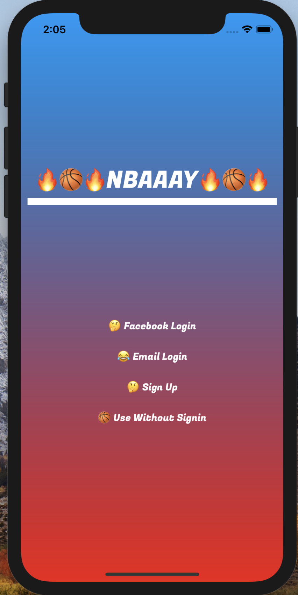
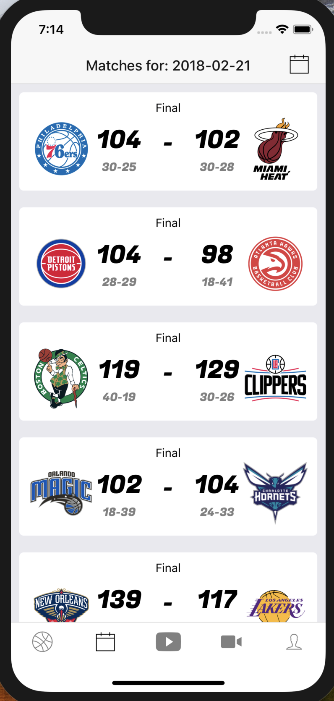
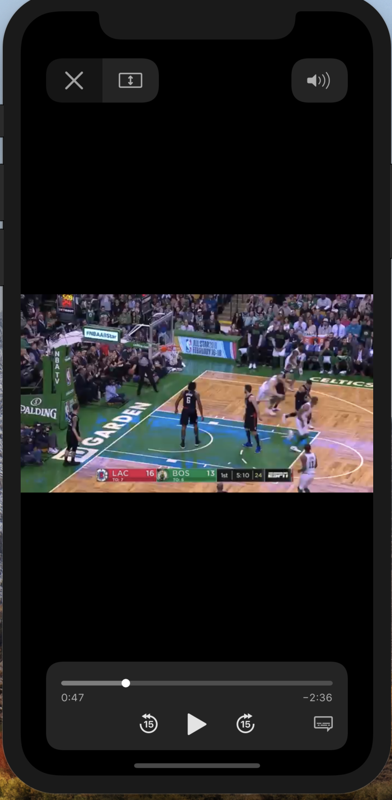
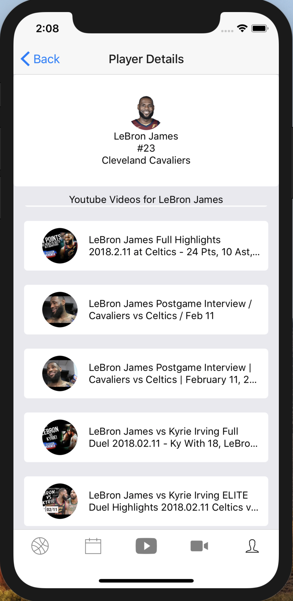
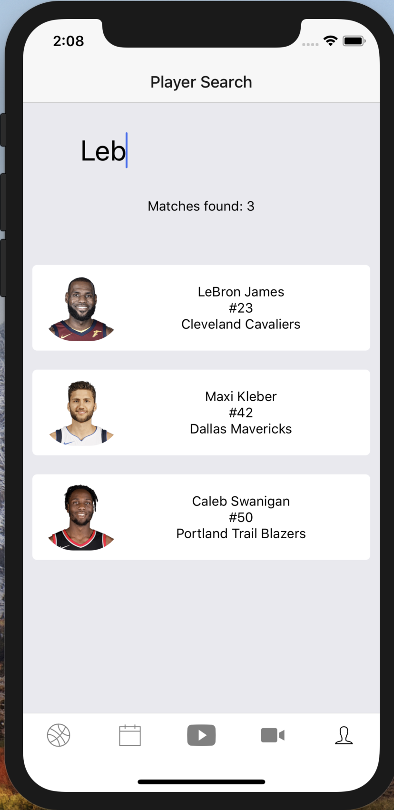
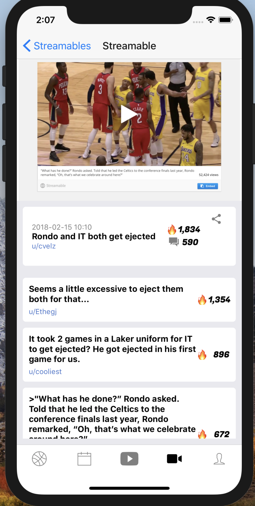
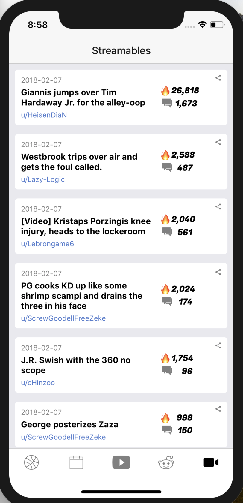
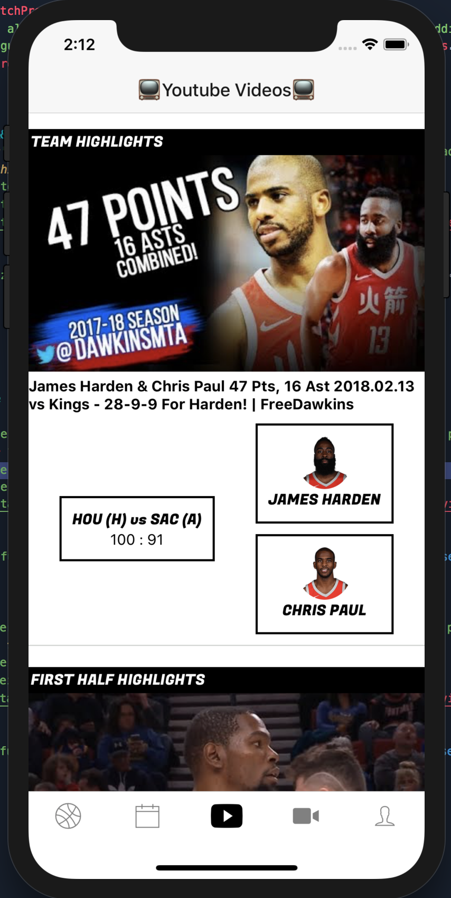

# 🔥🏀🔥NBAAAY🔥🏀🔥 (v0.1)
react native code for nbaaay.

  
  
  
  
  
  
  
  

# Why did I make this app?
This is personal project that I made using react native and the expo (https://expo.io/) platform.
As a web developer using react, I wanted to learn more about react native and expo.
I also don't live in the US so I can't  watch nba games live, so I wanted something I could quickly check to see whats happening.
This is for personal use / learning more about the technology, and has no commercial purpose.

# What does this app do?
This application was created to be a media center / nba recap application for people who can't watch games live.
Based on the matches going on for the day, the backend service (https://github.com/WataruKay/nbaaay_backend) is finding relevant youtube videos, reddit threads, and streamable clips.
This application consumes the data and presents it in a friendly way, allowing users to quickly glance at the match results, and check out any related youtube videos / reddit posts / streamable clips.

# Main features
1. Daily match results
2. Youtube videos for matches of the day (categorized into various types such as match highlight, player highlight, interview etc.)
3. Game thread / post game thread from https://reddit.com/r/nba
4. streamable clips posted on https://reddit.com/r/nba + the comments on the post itself
5. Ability to search through a player database to see compiled list of youtube videos of particular players.

# Future features to be developed
1. push notification for specific team / players
2. news feed based on user favorite team / favorite player
3. game thread / post game thread viewer

# Try it!
Use the expo app on iOS or android and open the app link https://expo.io/@watarukay/nbaaay,
or scan the qr code below with the expo app to run.

  

